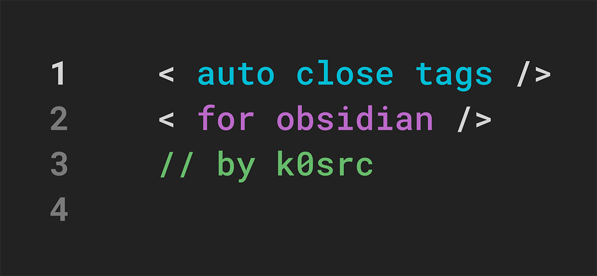

# Auto Close Tags

Automatically close HTML tags as you type in [Obsidian](https://obsidian.md/).



## Installation

Install from the **Community Plugins** section in Obsidian:

1. Open Obsidian Settings
2. Go to **Community Plugins** → **Browse**
3. Search for "Auto Close Tags"
4. Click **Install** and **Enable**

## Features

-   **Auto-close on typing**: Automatically adds closing tags when you type `>`
-   **Auto-close on paste**: Works when pasting HTML content
-   **Manual closing**: Use the "Close last unclosed tag" command (configurable hotkey)
-   **Smart detection**: Handles nested tags and self-closing elements
-   **Exclude tags**: Configure which tags to ignore in settings
-   **Code block awareness**: Optionally ignore tags in code blocks and inline code

## Settings

-   **Excluded tags**: Comma-separated list of tags to ignore (e.g., `div, span, i`)
-   **Cursor position**: Place cursor between tags or after closing tag
-   **Ignore fenced code blocks**: Skip auto-closing in ` ``` ` code blocks
-   **Ignore inline code**: Skip auto-closing in `inline code` spans

## Development

```bash
npm install
npm run build
```
